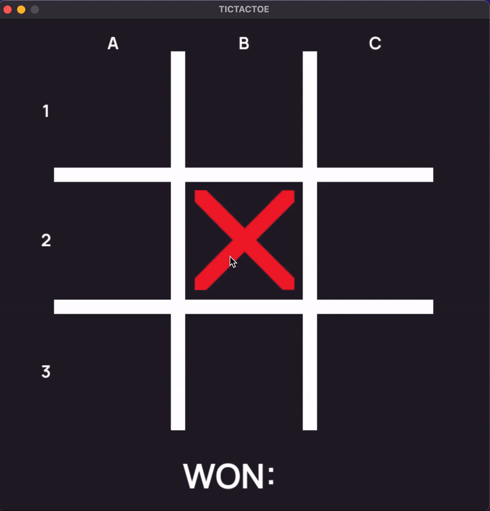

# TIC_TAC_GO

1. Install Poetry following the [official documentation](https://python-poetry.org/docs/#installation)
2. Run these commands in project directory:
```bash
poetry install
poetry run python main.py
```

---



> Press R to reset the game

> Press Q to exit the game

